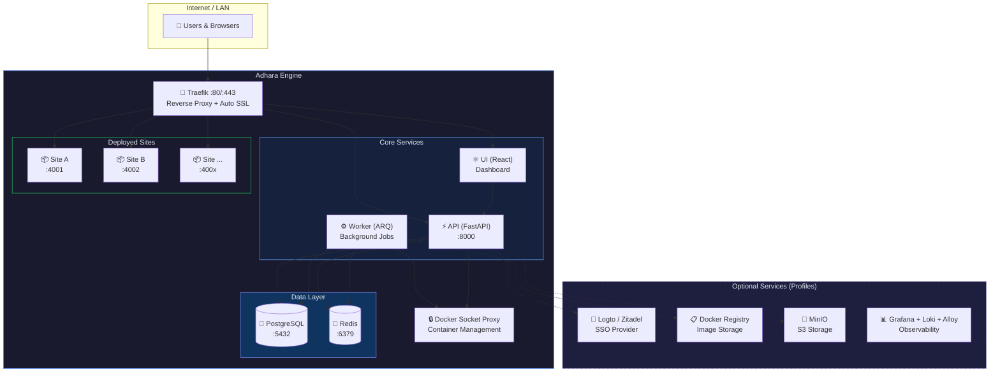
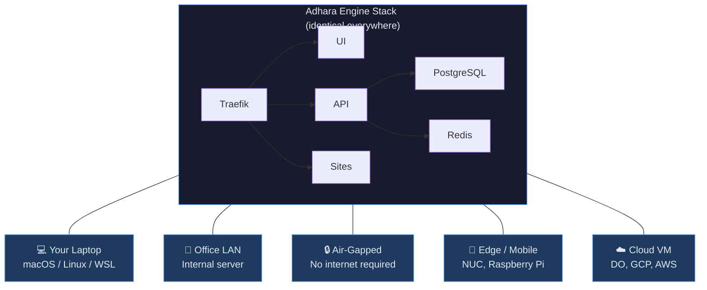
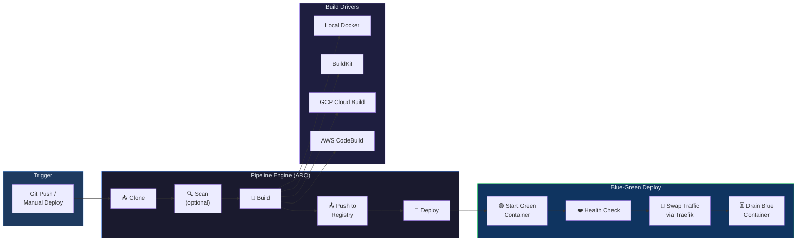
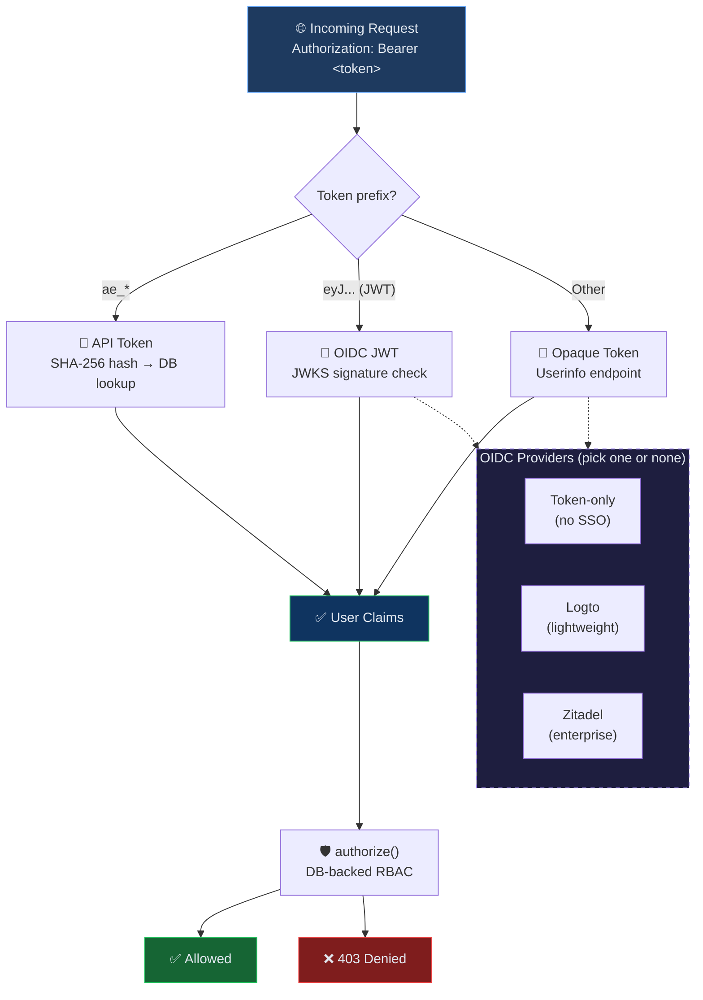

# Adhara Engine

> Copyright (c) 2024-2026 EIM Global Solutions, LLC.
> Licensed under the [Business Source License 1.1](LICENSE) — free for companies under $1M revenue.

A self-hosted, multi-tenant deployment platform for web applications. Deploy sites through a web dashboard, CLI, or API — backed by Docker containers with automatic routing, SSL, and authentication.

## Why Adhara Engine?

Getting code from your laptop to a running website is harder than it should be. Even for a simple app, you're wrangling Dockerfiles, nginx configs, SSL certificates, DNS records, port management, reverse proxies, and deploy scripts. Multiply that by 5 or 10 sites and you're spending more time on infrastructure than on building.

**Adhara Engine handles all of that so you don't have to.**

| Without Adhara Engine | With Adhara Engine |
|----------------------|-------------------|
| Write Dockerfiles, build images, push to a registry manually | Push code or an image — the engine builds and deploys it |
| Configure nginx/Traefik routing for each site by hand | Automatic routing — every site gets a hostname instantly |
| Manage SSL certs with certbot, cron jobs, renewal scripts | Auto-SSL via Let's Encrypt — zero configuration |
| Track which port each app is on, avoid conflicts | Automatic port assignment from a managed pool |
| Roll back by SSH-ing in and restarting old containers | One-click rollback from the dashboard or CLI |
| No visibility into what's running or why something broke | Built-in logs, health checks, and auto-healing |

**Who is this for?**

- **Freelancers and agencies** — Host all your client sites on one server instead of paying per-site on Vercel, Netlify, or Railway
- **Small teams** — Run internal tools on your office network without exposing them to the internet
- **Enterprises** — Deploy in air-gapped or compliance-restricted environments with full data ownership
- **Anyone tired of deploy scripts** — If you've ever written a `deploy.sh` that SSHs into a server and runs `docker compose up`, this replaces that

The engine is self-contained. There's some initial setup (covered step-by-step below), but once it's running, deploying a new site is as simple as:

```bash
adhara-engine site create --workspace my-team/production --name "My App" --port 3000
adhara-engine site deploy my-team/production/my-app
```

### The Name

*Adhara* (अधार) means **foundation** in Sanskrit — the base that everything else is built on. It's also the name of one of the brightest stars in the night sky (Epsilon Canis Majoris), a guiding light visible from both hemispheres.

That's the idea behind Adhara Engine: a solid foundation for deploying your projects, and a bright point of reference to guide you from code to a running site — whether that's on your laptop, your local network, or a cloud server halfway around the world.

## Where It Runs

Adhara Engine is designed to run **anywhere Docker runs** — online or offline, cloud or closet.

| Environment | Example | Internet Required? |
|-------------|---------|-------------------|
| **Your laptop** | macOS / Linux / WSL development machine | No |
| **Office LAN** | A server on your local network serving internal tools | No |
| **Air-gapped intranet** | Government, military, or compliance-restricted networks | No |
| **Mobile / edge** | A NUC or Raspberry Pi at a remote site or event | No |
| **Cloud VM** | DigitalOcean, GCP, AWS, Hetzner, etc. | Yes (for SSH + HTTPS certs) |

The core engine (~500 MB) has **zero external dependencies at runtime** — no SaaS APIs, no phone-home, no license servers. Once the Docker images are built, everything runs locally. DNS, SSL, and SSO are optional layers you add when you need them.

**Typical use cases:**
- Host client websites from a single VPS without paying per-site platform fees
- Run an internal tool platform on a company LAN with no public internet exposure
- Deploy preview environments on a dev machine before pushing to production
- Operate a self-contained deployment platform in air-gapped or compliance-restricted environments

## Architecture

### System Overview



### Where It Runs



## Prerequisites

- **Docker** (any runtime: Docker Desktop, OrbStack, Colima, Podman)
- **Docker Compose** v2+ (included with Docker Desktop / OrbStack)
- **Git**
- **Make**

Optional (for CLI usage):
- **Python 3.11+** and **uv** (for the CLI tool)

## Setup

Pick the environment that matches where you want to run. All three paths end at the same place: a running Adhara Engine you can access in your browser.

- [Local Machine](#local-machine-setup) — Your laptop or a machine on your LAN (fastest to get started)
- [DigitalOcean](#digitalocean-setup) — Cloud VPS, simplest remote path
- [Google Cloud Platform](#google-cloud-platform-setup) — Cloud VM with additional firewall/IAM steps

---

### Local Machine Setup

Works on macOS, Linux, or WSL. No server provisioning — just Docker and a terminal.

**Prerequisites:** Docker (Docker Desktop, OrbStack, Colima, or Podman), Git, Make

```bash
# 1. Clone the repo
git clone git@github.com:EIM-Global/adhara_engine.git
cd adhara_engine

# 2. Build and start (creates .env, generates secrets, runs migrations)
make init

# 3. Create an API token to log in
make token

# 4. Open the dashboard
open http://engine.localhost
```

That's it. The engine is running at **http://engine.localhost**.

> **LAN access:** Other machines on your network can reach the dashboard at `http://YOUR_LOCAL_IP`. Set `ADHARA_HOST=YOUR_LOCAL_IP` in `.env` before running `make init` if you want hostname routing to work for LAN clients.

> **Offline / air-gapped:** If you're deploying without internet, clone the repo and pre-pull the Docker images on a connected machine first, then transfer via USB or internal registry.

---

### DigitalOcean Setup

#### 1. Create the Droplet

1. Go to **DigitalOcean → Create → Droplets**
2. Choose **Ubuntu 24.04 LTS**
3. Select a plan:

| Scale | Droplet | vCPU | RAM | Monthly | Sites |
|-------|---------|------|-----|---------|-------|
| Small (testing) | Basic, Regular | 2 | 4 GB | ~$24/mo | 5-15 |
| Standard | Basic, Regular | 4 | 8 GB | ~$48/mo | 15-50 |
| Large | Basic, Premium | 8 | 16 GB | ~$96/mo | 50-100+ |

4. Choose a datacenter region close to your users
5. Under **Authentication**, select **SSH Key** and add your public key (see step 2 if you don't have one yet)
6. Click **Create Droplet** and note the IP address

#### 2. Set up your SSH key (on YOUR computer)

> **Already have an SSH key?** Run `cat ~/.ssh/id_ed25519.pub` (or `id_rsa.pub`). If you see a key starting with `ssh-ed25519` or `ssh-rsa`, skip to step 3.

If you don't have an SSH key yet, create one **on your local machine** (not the server):

```bash
# Run this on YOUR computer (Mac/Linux terminal, or Git Bash on Windows)
ssh-keygen -t ed25519 -C "your-email@example.com"
```

- Press **Enter** to accept the default file location (`~/.ssh/id_ed25519`)
- Enter a passphrase (optional but recommended) or press **Enter** twice for no passphrase
- Two files are created:
  - `~/.ssh/id_ed25519` — your **private** key (never share this)
  - `~/.ssh/id_ed25519.pub` — your **public** key (this goes on servers)

Copy your public key to your clipboard:

```bash
# macOS
cat ~/.ssh/id_ed25519.pub | pbcopy

# Linux
cat ~/.ssh/id_ed25519.pub | xclip -selection clipboard

# Or just print it and copy manually
cat ~/.ssh/id_ed25519.pub
```

Go back to DigitalOcean → **Settings → Security → SSH Keys → Add SSH Key**, paste the public key, and give it a name. Now create your Droplet with this key selected.

#### 3. Create a deploy user (don't run as root)

SSH into the droplet as root:

```bash
ssh root@YOUR_DROPLET_IP
```

> **First time connecting?** You'll see "The authenticity of host can't be established." Type `yes` and press Enter.

Now create a non-root user. This is important — you should never run applications as root:

```bash
# Create the user (you'll be prompted to set a password and some optional info)
adduser deploy

# Give them sudo access (required for installing packages, running scripts)
usermod -aG sudo deploy

# Give them Docker access (so they can run containers without sudo)
usermod -aG docker deploy
```

Copy your SSH key from root to the new user so you can SSH in directly as `deploy`:

```bash
# Copy root's authorized keys to the deploy user
mkdir -p /home/deploy/.ssh
cp ~/.ssh/authorized_keys /home/deploy/.ssh/
chown -R deploy:deploy /home/deploy/.ssh
chmod 700 /home/deploy/.ssh
chmod 600 /home/deploy/.ssh/authorized_keys
```

Verify it works before logging out of root:

```bash
# Log out of root
exit

# SSH back in as deploy — this should work without a password
ssh deploy@YOUR_DROPLET_IP

# Verify sudo works (enter the password you set above)
sudo whoami
# Should print: root
```

> **If you get "Permission denied":** Your SSH key wasn't copied correctly. SSH back in as root and re-run the `cp`/`chown`/`chmod` commands above.

#### 4. Install Docker

Follow DigitalOcean's official Docker installation guide for your Ubuntu version:

**[How to Install and Use Docker on Ubuntu (DigitalOcean)](https://www.digitalocean.com/community/tutorial-collections/how-to-install-and-use-docker)**

After Docker is installed, verify the `deploy` user can run containers (we added them to the `docker` group in step 3):

```bash
# IMPORTANT: Log out and back in so the docker group takes effect
exit
ssh deploy@YOUR_DROPLET_IP

# Verify Docker works without sudo
docker run --rm hello-world
```

You should see "Hello from Docker!" — if you get a permission error, make sure you logged out and back in after installing Docker.

#### 5. Install Make and clone the repo

```bash
sudo apt update && sudo apt install -y make git
```

Now set up an SSH key **on the server** for GitHub access:

```bash
# Generate a key on the server
ssh-keygen -t ed25519 -C "deploy@YOUR_DROPLET_IP"
# Press Enter for all prompts (no passphrase needed for deploy keys)

# Print the public key
cat ~/.ssh/id_ed25519.pub
```

Copy that public key and add it to GitHub:
1. Go to **github.com → EIM-Global/adhara_engine → Settings → Deploy keys → Add deploy key**
2. Paste the key, give it a title (e.g., "Droplet deploy key"), check **Allow read access**
3. Click **Add key**

Now clone and enter the repo:

```bash
mkdir -p ~/projects && cd ~/projects
git clone git@github.com:EIM-Global/adhara_engine.git
cd adhara_engine
```

#### 6. Start the engine

```bash
# Creates .env with auto-generated secrets, builds images, runs migrations
make init

# Create an API token to log in
make token
```

The token will be printed to the terminal — **copy it now**, you'll need it to log in.

#### 7. Access the dashboard

Open `http://YOUR_DROPLET_IP` in your browser. Paste the API token from step 6 to log in.

You now have a running Adhara Engine. The following steps are optional:

#### 8. (Optional) Set up SSO

See [Authentication Modes](#authentication-modes) below for Logto or Zitadel SSO setup.

#### 9. (Optional) Enable HTTPS

See [Enabling HTTPS](#enabling-https) below to set up a domain with auto-SSL.

#### 10. (Optional) Harden security

```bash
sudo bash scripts/adhara-secure.sh
```

This configures UFW firewall rules and locks down internal ports.

---

### Google Cloud Platform Setup

#### Automated (recommended)

The fastest way to deploy to GCP — an interactive wizard that creates the VM, installs Docker, configures auth, and starts the engine:

```bash
bash scripts/deploy_gcp.sh
```

The wizard will walk you through VM size, zone, authentication mode (token/Logto/Zitadel), optional services, and domain setup. Everything is scriptable via `gcloud`.

#### Manual

If you prefer to set things up step by step, or need to customize beyond what the wizard offers, follow the manual instructions below. For the full GCP-specific guide (VM sizing, IAP tunnels, service accounts), see **[docs/GCP_DEPLOYMENT.md](docs/GCP_DEPLOYMENT.md)**.

#### 1. Create the VM

```bash
gcloud compute instances create adhara-engine \
  --zone=us-central1-a \
  --machine-type=e2-standard-4 \
  --boot-disk-size=100GB \
  --boot-disk-type=pd-ssd \
  --image-family=ubuntu-2404-lts-amd64 \
  --image-project=ubuntu-os-cloud \
  --tags=adhara-engine
```

Or via the Console: **Compute Engine → VM Instances → Create** (Ubuntu 24.04 LTS, 100 GB SSD).

#### 2. Open firewall ports

GCP blocks all inbound traffic by default. You must create firewall rules:

```bash
# HTTP (required — Let's Encrypt + site traffic)
gcloud compute firewall-rules create adhara-allow-http \
  --allow=tcp:80 \
  --target-tags=adhara-engine \
  --description="Adhara Engine HTTP"

# HTTPS
gcloud compute firewall-rules create adhara-allow-https \
  --allow=tcp:443 \
  --target-tags=adhara-engine \
  --description="Adhara Engine HTTPS"
```

#### 3. Create a deploy user, install Docker, and clone

SSH into the VM:

```bash
gcloud compute ssh adhara-engine --zone=us-central1-a
```

Then follow the same steps as DigitalOcean:

```bash
# Create deploy user (if not using the default GCP user)
sudo adduser deploy
sudo usermod -aG sudo deploy
sudo usermod -aG docker deploy

# Install Docker
curl -fsSL https://get.docker.com | sh

# Install Make and clone
sudo apt update && sudo apt install -y make git
mkdir -p ~/projects && cd ~/projects
git clone git@github.com:EIM-Global/adhara_engine.git
cd adhara_engine
```

> **GCP SSH keys:** If you created a `deploy` user, add your SSH key via **Compute Engine → Metadata → SSH Keys**, or copy it manually as shown in the DigitalOcean section.

#### 4. Start the engine

```bash
make init
make token
```

Open `http://EXTERNAL_IP` in your browser (find the external IP with `gcloud compute instances describe adhara-engine --zone=us-central1-a --format='get(networkInterfaces[0].accessConfigs[0].natIP)'`).

#### 5. Next steps

- **HTTPS:** See [Enabling HTTPS](#enabling-https)
- **SSO:** See [Authentication Modes](#authentication-modes)
- **Full GCP guide:** See [docs/GCP_DEPLOYMENT.md](docs/GCP_DEPLOYMENT.md) for IAP tunnels, service accounts, and advanced networking

## Quickstart

```bash
git clone git@github.com:EIM-Global/adhara_engine.git && cd adhara_engine
make init && make token
```

Open **http://engine.localhost** and log in with the token. See [Local Machine Setup](#local-machine-setup) for details or [Setup](#setup) for cloud deployment guides.

## Deploy Your First Site

Adhara Engine ships with an example podcast website you can deploy in under 5 minutes to see the full workflow in action.

### 1. Build the example site

```bash
cd examples/podcast-site
docker build -t engine.localhost/podcast-site:latest .
docker push engine.localhost/podcast-site:latest
```

### 2. Create a tenant, workspace, and site

```bash
# Install the CLI (if you haven't already)
cd ../..
make install

# Create a tenant and workspace
adhara-engine tenant create --name "Demo" --email you@example.com --plan pro
adhara-engine workspace create --tenant demo --name "Sites"

# Create the site pointing to your image
adhara-engine site create \
  --workspace demo/sites \
  --name "Podcast Site" \
  --source docker_image \
  --image "engine.localhost/podcast-site:latest" \
  --port 3000
```

### 3. Deploy and open it

```bash
adhara-engine site deploy demo/sites/podcast-site

# Open in your browser
open http://podcast-site.sites.demo.localhost
```

That's the complete workflow: build an image, create a site, deploy. The site is now running in a container with automatic Traefik routing.

> **Want to customize it?** Edit `examples/podcast-site/src/data.ts` to change the podcast name, episodes, and host info. Rebuild and redeploy with `docker build` + `adhara-engine site deploy`.

See the [example site README](examples/podcast-site/README.md) for more details, including how to deploy to Vercel.

## Deployment Profiles

Adhara Engine uses Docker Compose profiles to let you run only the services you need. The core profile is lightweight (~500MB) and uses API token auth — no SSO provider, Grafana, or MinIO required.

### Profile Overview

| Profile | Services Added | Extra RAM | Use Case |
|---------|---------------|-----------|----------|
| *(core — default)* | api, worker, ui, traefik, db, redis | ~500MB | Small servers, simple deployments |
| `auth` | + logto | +150MB | **SSO (default)** — lightweight OIDC |
| `zitadel` | + zitadel, zitadel-login | +800MB | SSO (enterprise) — advanced multi-tenancy |
| `observability` | + loki, alloy, grafana | +400MB | Log aggregation + dashboards |
| `registry` | + docker registry v2 | +30MB | Private image hosting |
| `storage` | + minio | +100MB | S3-compatible object storage |
| `all` | Everything (uses Logto for auth) | ~1.3GB total | Full-featured setup |

### Quick Start by Profile

```bash
# Core only — token auth, minimal resources
make init
make token            # generate an API token to log in

# Core + Logto SSO (recommended)
make init-auth

# Core + Zitadel SSO (enterprise — heavier)
make init-zitadel

# Full — Logto SSO + logging + storage + registry
make init-full

# Mix and match profiles
docker compose --profile auth --profile observability up -d
```

### Make Targets

| Command | Description |
|---------|-------------|
| `make init` | Core services only (~500MB, token auth) |
| `make init-auth` | Core + Logto SSO (~650MB) |
| `make init-zitadel` | Core + Zitadel SSO (~1.3GB) |
| `make init-full` | All services with Logto (~1.3GB) |
| `make up` | Start core services |
| `make up-auth` | Core + Logto SSO |
| `make up-zitadel` | Core + Zitadel SSO |
| `make up-full` | Start all services |
| `make up-obs` | Core + observability |
| `make token` | Create a platform-admin API token |

### Authentication Modes

**Token auth** (core profile — no SSO provider):
- Run `make token` to generate an `ae_*` API token
- Enter the token on the login page
- Stored in browser localStorage — no external auth service needed

**Logto SSO** (auth profile — default SSO):
- Run `make init-auth` or `make up-auth`
- Open Logto Admin Console at `http://localhost:3002`
- Create an application, copy the Client ID to `ui/.env` as `VITE_OIDC_CLIENT_ID`
- Rebuild the UI: `docker compose up -d --build ui`
- ~150MB overhead, single container, standard OIDC with PKCE

**Zitadel SSO** (zitadel profile — enterprise):
- Run `make init-zitadel` or `make up-zitadel`
- Run `bash scripts/setup-zitadel.sh` after first boot
- ~800MB overhead, two containers, enterprise multi-tenancy and audit logging

The UI automatically detects which mode to use based on whether `VITE_OIDC_CLIENT_ID` is set in `ui/.env`.

## Production Profiles

After completing the [server setup](#new-server-setup) above (which uses `make init` for the core profile), you can add more services:

```bash
# Add Logto SSO
make init-auth

# Or add everything (Logto SSO + logging + storage + registry)
make init-full

# Or mix profiles manually
docker compose --profile auth --profile observability up -d
```

See [Deployment Profiles](#deployment-profiles) for the full list of profiles and what each adds.

### Enabling HTTPS

HTTPS uses Let's Encrypt via Traefik's built-in ACME support. The certificate is issued automatically — you just need a domain pointing to your server.

#### Step 1: Get your server's IP

```bash
curl -s ifconfig.me
# Example output: 165.245.135.53
```

#### Step 2: Create a DNS record

Go to your domain registrar or DNS provider (Cloudflare, Namecheap, Route 53, DigitalOcean DNS, etc.) and create an **A record**:

| Type | Name | Value | TTL |
|------|------|-------|-----|
| **A** | `engine` | `165.245.135.53` (your server IP) | 300 |

This makes `engine.yourdomain.com` point to your server.

**Which record type to use:**
- **A record** (recommended) — Points directly to an IP address. Use this for VPS/droplet deployments.
- **CNAME record** — Points to another domain name. Use this only if your server has a stable hostname (e.g. a load balancer). Cannot be used on the root/apex domain (`yourdomain.com`), only subdomains (`engine.yourdomain.com`).

**Example configurations by provider:**

| Provider | Where to add records |
|----------|---------------------|
| **Cloudflare** | DNS → Add Record. **Disable the orange proxy cloud** (set to DNS only) so Traefik can get the cert directly. |
| **Namecheap** | Advanced DNS → Add New Record |
| **DigitalOcean** | Networking → Domains → Add Record |
| **Route 53** | Hosted Zones → your domain → Create Record |
| **Google Domains** | DNS → Custom Records → Manage |

#### Step 3: Verify DNS propagation

Wait for the DNS record to propagate (usually 1-5 minutes, up to 48 hours):

```bash
# Check if the record resolves to your server
dig +short engine.yourdomain.com
# Should return: 165.245.135.53

# Or use nslookup
nslookup engine.yourdomain.com
```

**Do not proceed until the domain resolves to your server's IP.** Let's Encrypt will fail to issue a certificate if the domain doesn't point to the right server, and too many failed attempts will rate-limit you.

#### Step 4: Configure and activate HTTPS

```bash
# Add domain and email to .env
echo "ADHARA_DOMAIN=engine.yourdomain.com" >> .env
echo "ACME_EMAIL=you@yourdomain.com" >> .env

# Run the secure script — generates Traefik HTTPS config
sudo bash scripts/adhara-secure.sh

# Restart Traefik to request the certificate
docker compose restart traefik
```

Traefik will automatically:
1. Respond to Let's Encrypt's HTTP-01 challenge on port 80
2. Obtain and store the TLS certificate
3. Redirect all HTTP traffic to HTTPS
4. Auto-renew the certificate before expiry

#### Step 5: Verify the certificate

```bash
# Check that HTTPS works (may take 30-60 seconds on first request)
curl -v https://engine.yourdomain.com/ 2>&1 | grep "SSL certificate"

# Or just open in your browser — you should see the lock icon
```

If the certificate fails, check Traefik logs:
```bash
docker logs adhara-engine-traefik-1 --tail 30 | grep -i acme
```

Common issues:
- **Domain doesn't resolve** — DNS not propagated yet. Wait and retry.
- **Port 80 blocked** — UFW or cloud firewall blocking HTTP. Ensure port 80 is open.
- **Cloudflare proxy enabled** — Disable the orange cloud (proxy) so Traefik handles TLS directly.
- **Rate limited** — Too many failed attempts. Wait 1 hour and retry.

#### Step 6: Update Zitadel for HTTPS

Once HTTPS is confirmed working, update Zitadel to use the secure domain:

```bash
# Update .env — Zitadel now uses the domain instead of IP
sed -i 's/^ADHARA_HOST=.*/ADHARA_HOST=engine.yourdomain.com/' .env

# Wipe Zitadel state (it bakes the domain into its database on first init)
docker compose down zitadel zitadel-login
docker volume rm adhara-engine_zitadel-bootstrap
# Note: Only remove pgdata if you haven't created users/apps you need to keep
docker volume rm adhara-engine_pgdata

# Restart everything
docker compose up -d

# Re-run Zitadel setup with the new domain
bash scripts/setup-zitadel.sh
```

Your Zitadel console will now be at `https://engine.yourdomain.com/ui/console/` and all OIDC flows will use HTTPS.

### Remote Admin Access

Internal services (Grafana, Traefik Dashboard, MinIO Console, etc.) are bound to localhost only. Access them via SSH tunnel:

```bash
ssh -L 8080:localhost:8080 -L 3003:localhost:3003 -L 9001:localhost:9001 user@your-server
```

Then open `http://localhost:8080` (Traefik), `http://localhost:3003` (Grafana), etc. locally.

## Zitadel Authentication Setup

Adhara Engine uses [Zitadel](https://zitadel.com) for OIDC authentication with PKCE flow.

### Step 1: Start the stack

```bash
make init    # or `make up` if already initialized
```

Wait for all services to be healthy:

```bash
make status
```

### Step 2: Run the Zitadel setup wizard

```bash
bash scripts/setup-zitadel.sh
```

This interactive script will:

1. Wait for Zitadel to become healthy
2. Open the Zitadel Console at **http://\<ADHARA_HOST\>/ui/console/** (routed through Traefik on port 80)
3. Walk you through creating an OIDC project and application
4. Collect the generated **Client ID**
5. Write the Client ID to `.env` and `ui/.env`

**Default Zitadel admin credentials:**
| Field | Value |
|-------|-------|
| Email | `zitadel-admin@zitadel.<ADHARA_HOST>` (e.g. `zitadel-admin@zitadel.localhost`) |
| Password | `Password1!` |

### Step 3: Configure the OIDC application in Zitadel Console

When the wizard prompts you, create the application with these settings:

| Setting | Value |
|---------|-------|
| **App Type** | User Agent |
| **Authentication Method** | PKCE |
| **Redirect URIs** | `http://<ADHARA_HOST>/auth/callback` |
|                    | `http://localhost/auth/callback` (for local dev) |
| **Post-Logout URIs** | `http://<ADHARA_HOST>` |
|                       | `http://localhost` (for local dev) |

> **Note:** Everything routes through Traefik on port 80. The redirect URIs must match `window.location.origin` exactly — no port number for port 80. Enable **Development Mode** in Zitadel to allow `http://` redirect URIs.

### Step 4: Create users

```bash
# Interactive mode
bash scripts/create-user.sh

# Batch mode
bash scripts/create-user.sh \
  --email user@example.com \
  --first John \
  --last Doe \
  --password 'SecurePass1!' \
  --role admin
```

Password requirements: min 8 characters, at least one uppercase, one number, one special character.

### Step 5: Restart the UI to pick up the new config

```bash
docker compose restart ui
```

Now visit **http://engine.localhost** — you'll be redirected to Zitadel login.

## Environment Variables

Copy the example and edit:

```bash
cp .env.example .env
```

| Variable | Default | Description |
|----------|---------|-------------|
| `ADHARA_HOST` | `localhost` | Server IP or hostname (used by Zitadel, API) |
| `ADHARA_DOMAIN` | *(unset)* | Domain for HTTPS (e.g. `engine.example.com`) |
| `ENGINE_SECRET_KEY` | `change-me-to-a-random-string` | API secret key |
| `POSTGRES_PASSWORD` | `engine` | PostgreSQL password |
| `MINIO_ACCESS_KEY` | `engine` | MinIO access key |
| `MINIO_SECRET_KEY` | `engine-secret` | MinIO secret key |
| `OIDC_INTERNAL_URL` | `http://logto:3001` | OIDC provider internal URL |
| `OIDC_ISSUER` | `http://localhost:3001` | OIDC issuer (external URL) |
| `ZITADEL_MASTERKEY` | *(32 chars required)* | Zitadel encryption key (zitadel profile only) |
| `ZITADEL_DB_PASSWORD` | `zitadel` | Zitadel database password (zitadel profile only) |
| `GRAFANA_PASSWORD` | `admin` | Grafana admin password |
| `ACME_EMAIL` | `admin@adharaweb.com` | Let's Encrypt email |
| `DOCKER_HOST_SOCKET` | `/var/run/docker.sock` | Docker socket path |
| `API_BACKEND` | `http://api:8000` | UI → API proxy target |

The UI also has its own env file at `ui/.env`:

| Variable | Description |
|----------|-------------|
| `VITE_OIDC_ISSUER` | OIDC issuer URL (e.g. `http://localhost:3001` for Logto) |
| `VITE_OIDC_CLIENT_ID` | OIDC Client ID (leave empty for token-only auth) |

## Make Targets

### Lifecycle

| Command | Description |
|---------|-------------|
| `make init` | Core services only (~500MB, token auth) |
| `make init-auth` | Core + Logto SSO (~650MB) |
| `make init-zitadel` | Core + Zitadel SSO (~1.3GB, enterprise) |
| `make init-full` | All services with Logto (~1.3GB) |
| `make up` / `up-auth` / `up-zitadel` / `up-full` | Start services (matching profile) |
| `make up-obs` | Core + observability (Grafana, Loki, Alloy) |
| `make down` | Stop all services (engine only) |
| `make restart` | Restart all services |
| `make clean` | Stop everything and remove volumes (**destructive**) |
| `make token` | Create a platform-admin API token and save to .env |

### Development

| Command | Description |
|---------|-------------|
| `make dev` | Start in dev mode (API hot-reloads on file changes) |
| `make build` | Rebuild all images with no cache |

### Database

| Command | Description |
|---------|-------------|
| `make db-migrate` | Run Alembic database migrations |
| `make db-seed` | Seed database with sample data |
| `make db-reset` | Reset database (**destructive**) |

### CLI (`adhara-engine`)

The CLI lets you manage tenants, workspaces, sites, and deployments from the command line.

**Install (requires Python 3.11+ and [uv](https://docs.astral.sh/uv/)):**

```bash
# Option 1: Install globally (adds adhara-engine to your PATH)
make install

# Option 2: Install in a local venv
make cli-install
source cli/.venv/bin/activate
```

**Configure the CLI to talk to your engine:**

```bash
# Local development
export ADHARA_ENGINE_URL=http://localhost:8000
export ADHARA_ENGINE_TOKEN=<your-api-token>

# Remote server
export ADHARA_ENGINE_URL=http://<your-server-ip>:8000
export ADHARA_ENGINE_TOKEN=<your-api-token>
```

Generate an API token from the dashboard: **API Tokens** (sidebar) → **+ New Token**.

**Usage:**

```bash
adhara-engine --help
adhara-engine tenant list
adhara-engine site create --workspace my-tenant/my-workspace --name "My Site" --source docker_image
adhara-engine site deploy my-tenant/my-workspace/my-site
```

### Monitoring

| Command | Description |
|---------|-------------|
| `make status` | Show status of all services |
| `make logs` | Tail logs from all services |
| `make logs-api` | Tail API logs only |
| `make logs-service SVC=traefik` | Tail logs for a specific service |

### Deployed Sites

| Command | Description |
|---------|-------------|
| `make sites-status` | Show all deployed site containers |
| `make sites-up` | Start previously stopped site containers |
| `make sites-down` | Stop and remove all deployed site containers |
| `make sites-restart` | Restart all deployed site containers |

## Service URLs

Once running, these services are available:

| Service | Local URL | Production | Access |
|---------|-----------|------------|--------|
| **Web UI** | http://localhost | http://\<ADHARA_HOST\> | Public (port 80) |
| **API** | http://localhost:8000 | via Traefik `/api/*` | Localhost only |
| **API Docs** | http://localhost:8000/docs | via Traefik `/docs` | Localhost only |
| **Zitadel Console** | http://localhost/ui/console/ | http://\<ADHARA_HOST\>/ui/console/ | Via Traefik (port 80) |
| **Traefik Dashboard** | http://localhost:8080 | SSH tunnel required | Localhost only |
| **Grafana** | http://localhost:3003 | SSH tunnel required | Localhost only |
| **MinIO Console** | http://localhost:9001 | SSH tunnel required | Localhost only |

## Tech Stack

| Layer | Technology |
|-------|-----------|
| **Frontend** | React 19, TypeScript, Vite 7, Tailwind CSS 4, TanStack Query |
| **Backend** | FastAPI, SQLAlchemy, Alembic, Python 3.12 |
| **Auth** | API tokens (built-in), Logto OIDC, or Zitadel OIDC — PyJWT |
| **Database** | PostgreSQL 16, Redis 7 |
| **Proxy** | Traefik v3 (file-based routing + Let's Encrypt) |
| **Storage** | MinIO (S3-compatible) |
| **Logging** | Grafana Loki + Alloy → Grafana dashboards |
| **Registry** | Docker Registry v2 (local) |
| **CLI** | Typer + httpx + Rich |

## Further Documentation

| Guide | Description |
|-------|-------------|
| [Example: Podcast Site](examples/podcast-site/) | Complete example site — build, deploy, and customize |
| [Local Setup](docs/LOCAL_SETUP.md) | Detailed local development guide |
| [Deploying Sites](docs/DEPLOYING_SITES.md) | End-to-end deployment workflows |
| [Engine Integration](docs/ENGINE_INTEGRATION_GUIDE.md) | How to Dockerize apps for the engine |
| [GCP Deployment](docs/GCP_DEPLOYMENT.md) | Cloud deployment to Google Cloud |
| [Architecture](docs/ARCHITECTURE.md) | System design, data model, pipeline, RBAC |
| [Security Hardening](scripts/adhara-secure.sh) | UFW, HTTPS, port lockdown script |

## How It Works (Deep Dive)

These diagrams explain the internals — how deployments flow through the system and how authentication works. You don't need to understand these to use Adhara Engine, but they're helpful if you want to know what's happening under the hood.

### Deployment Pipeline

How code goes from push to live site — with zero-downtime blue-green deploys:



### Authentication Flow

Three auth modes — all feeding into the same RBAC system:



For the full architecture document including data models, build drivers, health monitoring, and RBAC details, see **[docs/ARCHITECTURE.md](docs/ARCHITECTURE.md)**.

## Troubleshooting

### Zitadel won't start

Zitadel needs the PostgreSQL `zitadel` database and user (created by `scripts/init-db.sql`). If the DB was initialized without this script:

```bash
docker compose exec db psql -U engine -c "CREATE USER zitadel WITH PASSWORD 'zitadel';"
docker compose exec db psql -U engine -c "CREATE DATABASE zitadel OWNER zitadel;"
docker compose restart zitadel
```

### "engine.localhost" doesn't resolve

Most modern browsers resolve `*.localhost` automatically. If yours doesn't, add to `/etc/hosts`:

```
127.0.0.1  engine.localhost
```

### OIDC login redirects fail

1. Verify `ZITADEL_CLIENT_ID` is set in both `.env` and `ui/.env`
2. Confirm redirect URIs match exactly in the Zitadel Console application settings
3. Restart the UI: `docker compose restart ui`

### Port conflicts

The default ports are: 80 (Traefik), 443, 5173 (UI), 8000 (API), 8080 (Traefik dash), 5432 (Postgres), 6379 (Redis), 3001/3002 (Logto OIDC/Admin), 3003 (Grafana), 3100 (Loki), 9000/9001 (MinIO), 5000 (Registry). Zitadel (if used) is routed through Traefik on port 80 (8081 localhost only).

Stop conflicting services or adjust ports in `docker-compose.yml`.

### Docker socket path (Colima / Podman)

Set `DOCKER_HOST_SOCKET` in `.env`:

```bash
# Colima
DOCKER_HOST_SOCKET=/Users/<you>/.colima/default/docker.sock

# Podman
DOCKER_HOST_SOCKET=/run/user/1000/podman/podman.sock
```

## License

Adhara Engine is source-available under the [Business Source License 1.1](LICENSE) (BSL 1.1).

### What you can do

| Use Case | Allowed? |
|----------|----------|
| Personal, non-commercial use | Yes |
| Evaluation, development, and testing | Yes |
| Academic or educational use | Yes |
| Production use by companies under **$1M annual revenue** | Yes |
| Production use by non-profit organizations | Yes |
| Production use by companies **over $1M annual revenue** | Requires a commercial license |
| Building a competing hosted deployment platform | Requires a commercial license |

### How it works

- The **source code is fully open** — you can read, modify, fork, and contribute
- Companies under $1M in annual revenue can use it in production **for free**, including to host client sites and build your business
- Once your company exceeds $1M in annual revenue, contact us for a commercial license
- On **March 13, 2030**, the license automatically converts to **Apache 2.0** (fully open source, no restrictions)

### What counts as "competing"

You need a commercial license if you offer Adhara Engine (or a modified version) as a **managed hosting platform** that competes directly with Adhara Engine itself. Using it to host your own sites, your clients' sites, or your company's internal tools is **not** competing — that's exactly what it's built for.

### Commercial licensing

If your company exceeds $1M in revenue or you want to build a competing service, contact **[EIM Global Solutions, LLC](mailto:hello@eimglobal.com)** for commercial licensing.

Copyright (c) 2024-2026 EIM Global Solutions, LLC and Patrick Farrell. See [LICENSE](LICENSE) for the full legal text.
